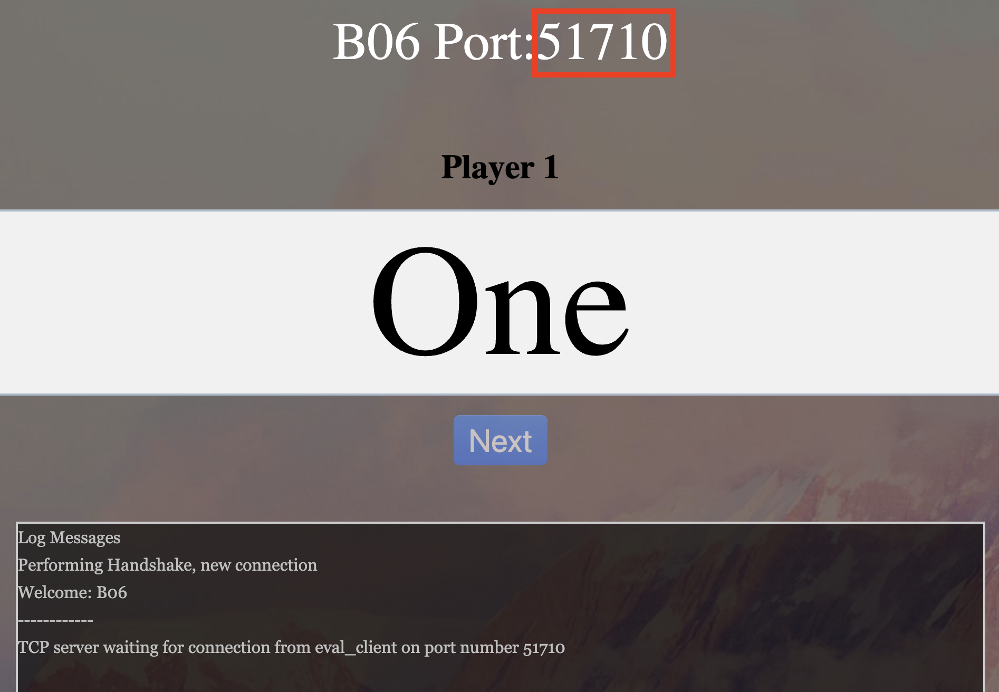
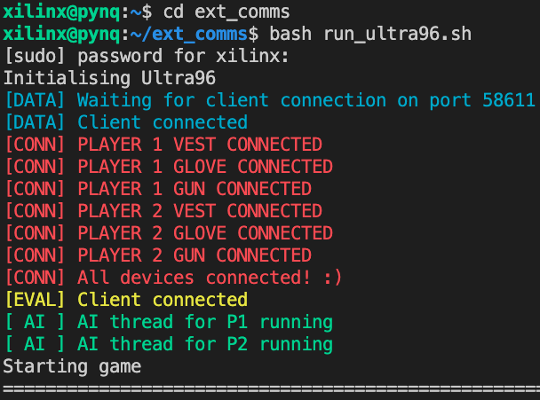
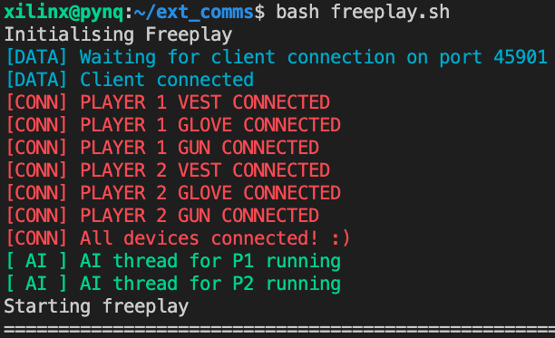

# Setup Guide
>Note:  
>- Keep all terminals open throughout evaluation  
>- To reset the Eval Server, just refresh the browser page
>- For Windows ssh commands, replace `localhost` with the laptop's ipv4 address

#### On Relay Laptop (MQTT broker)
1. On Docker Desktop, start the container for the MQTT broker. Alternatively, run `docker run -p 8080:8080 -p 1883:1883 hivemq/hivemq4` on a terminal.
2. On another terminal, run `ssh -R 1883:localhost:1883 xilinx@172.26.191.82`. This sets up the reverse ssh tunelling from the Ultra96 to the MQTT broker. 

#### On Visualiser
1. Input the ipv4 address for the relay laptop as the Broker Address.

## For Evaluation
#### On Eval Server Laptop
1. Download latest `eval_server.zip` from Canvas.
2. cd into server, run command `bash run_server.sh`.
3. Open `index.html` in `html` folder in your browser and input relevant fields:
    - Eval Server IP Addr: 127.0.0.1
    - Group name: B06
    - Password: 1234567890123456
    - **Click "The Team does not have a visualizer"**
4. The browser page should update. Take note of the port number.  

#### On Ultra96 Laptop
1. On a terminal, run `ssh -R 8888:localhost:<server port> xilinx@172.26.191.82`. This sets up the reverse ssh tunelling from the Ultra96 to the MQTT broker.  

2. On another terminal, ssh into Ultra96 using `ssh xilinx@172.26.191.82`.  
3. cd into `ext_comms` and run `bash run_ultra96.sh`. Enter the password for the Ultra96 if prompted.  
4. Terminal should print `[DATA] Waiting for client connection on port <data client port>`. Input this port number on the relay laptop (internal comms). On successful connection, you should see the message `[DATA] Client connected`.  
 

5. Once all devices have been connected, the message `[EVAL] Client connected` should appear on the terminal, and you browser tab should look like this.  

     
     

## For Freeplay
#### On Ultra96 Laptop
1. On a terminal, ssh into Ultra96 using `ssh xilinx@172.26.191.82`. 
3. cd into `ext_comms` and run `bash freeplay.sh`. Enter the password for the Ultra96 if prompted.  
4. Terminal should print `[DATA] Waiting for client connection on port <data client port>`. Input this port number on the relay laptop (internal comms). On successful connection, you should see the message `[DATA] Client connected`.
5. Once all devices have been connected, freeplay can begin. 
 
