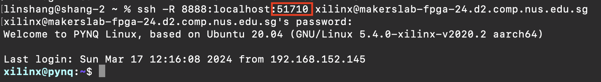
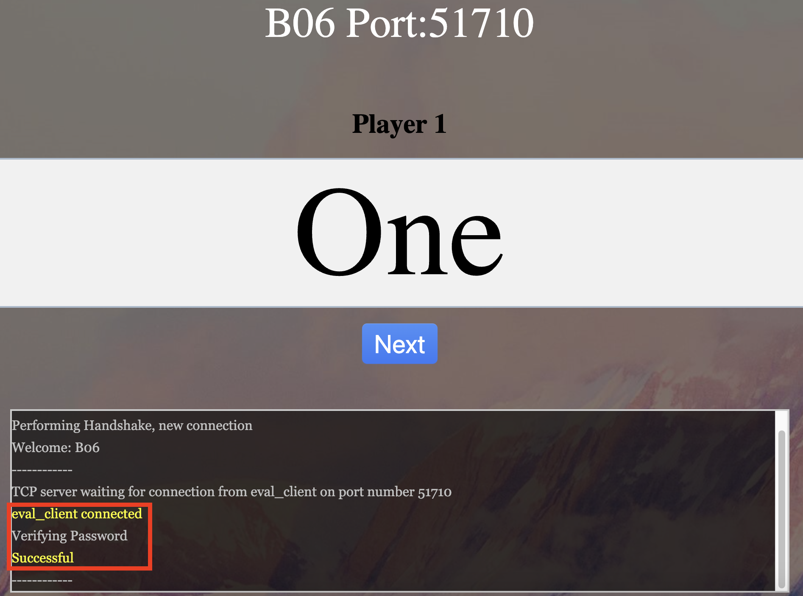

# Ext Comms Setup
>Note:  
>- Keep all terminals open throughout evaluation  
>- To reset the Eval Server, just refresh the browser page

If setting up MQTT

    

### On Relay Laptop (MQTT broker)

1. Run Docker Desktop.
2. On a terminal, run `docker run -p 8080:8080 -p 1883:1883 hivemq/hivemq4` to start the MQTT broker.
3. On another terminal, run `ssh -R 1883:localhost:1883 xilinx@makerslab-fpga-24.d2.comp.nus.edu.sg`. This sets up the reverse ssh tunelling from the Ultra96 to the MQTT broker. 

### On Visualiser
1. Input the ipv4 address for the relay laptop as the Broker Address.

### On Eval Server Laptop
1. Download `eval_server.zip` from telegram. (can also download from Canvas, but you have to update the files inside w files from `eval_server_bug_fix.zip`)
2. cd into server, run command `bash run_server.sh`.
3. Open `index.html` in `html` folder in your browser and input relevant fields:
    - Eval Server IP Addr: 127.0.0.1
    - Group name: B06
    - Password: 1234567890123456
    - **Click "The Team does not have a visualizer"**
4. The browser page should update. Take note of the port number.  

### On Ultra96 Laptop
1. On a terminal, run `ssh -R 8888:localhost:<server port> xilinx@makerslab-fpga-24.d2.comp.nus.edu.sg`. This sets up the reverse ssh tunelling from the Ultra96 to the MQTT broker.  
  
2. On another terminal, ssh into Ultra96 using `ssh xilinx@makerslab-fpga-24.d2.comp.nus.edu.sg`. 
3. cd into `ext_comms` and run `bash run_ultra96.sh`. Enter the password for the Ultra96 if prompted. Your browser tab should look like this after successful initialisation.  
  
4. Terminal should print `[DATA] Waiting for client connection on port <data client port>`. Input this port number on the relay laptop (internal comms).  
  
